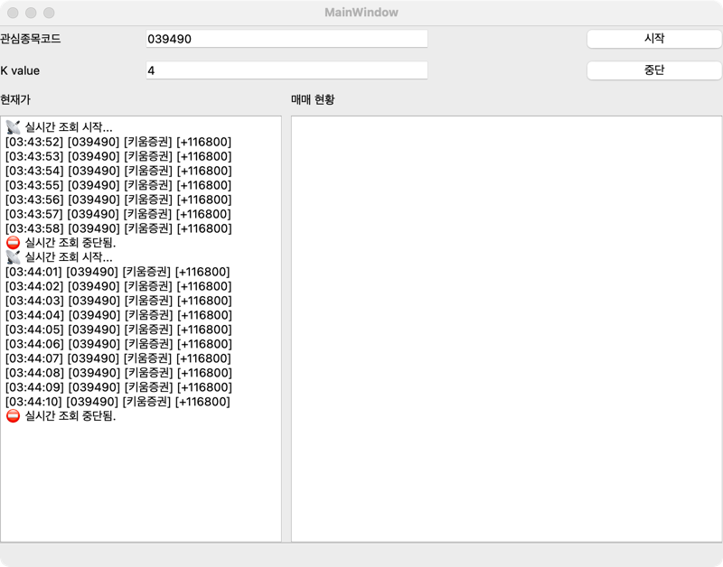
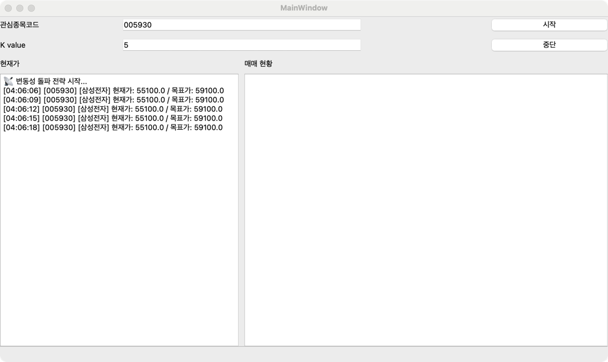

## Prerequisite

1. `.env.example` 파일을 복사하여 `.env` 파일을 생성합니다.

```bash
cp .env.example .env
```

`.env` 파일에서 환경 변수 값을 설정합니다. (모의투자/실전투자 여부에 따라 API 키 등이 달라집니다.)

2. 정상적인 토큰 발급을
   위해 [접근토큰발급.py](https://github.com/DolphaGo/kiwoom/blob/master/%ED%86%A0%ED%81%B0/%EC%A0%91%EA%B7%BC%ED%86%A0%ED%81%B0%EB%B0%9C%EA%B8%89.py)
   먼저 실행해주세요.

3. `QtDesigner` 를 설치하고 실행합니다 (macOS 기준)

```shell
brew install qt
open /opt/homebrew/bin/Designer
```

> 현재가 조회 추적



> 변동성 돌파 전략

